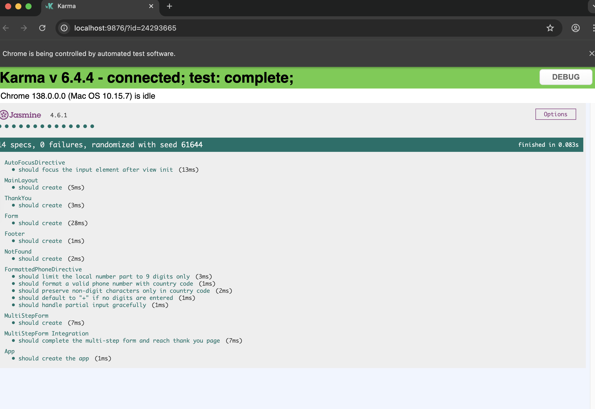
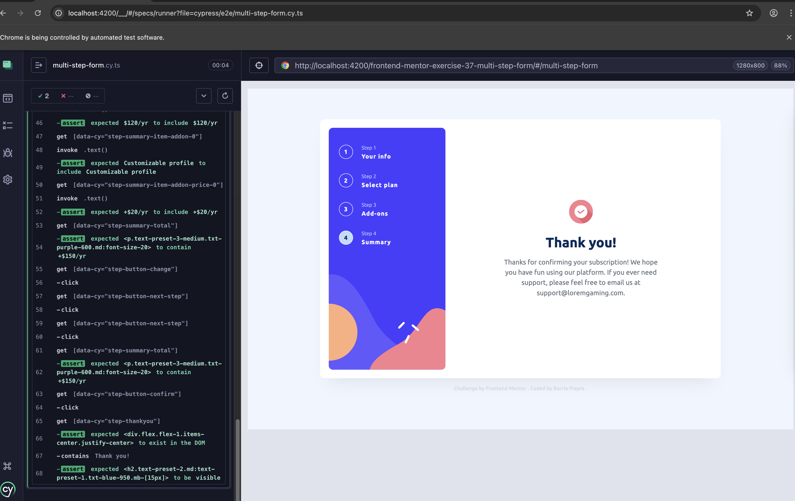

# Frontend Mentor - Multi-step form


## Code, Url Site and Repository of other challenges

* [Github](https://github.com/barriedirk/frontend-mentor-exercise-37-multi-step-form)
* [URL Site](https://barriedirk.github.io/frontend-mentor-exercise-37-multi-step-form/#/multi-step-form)
* [Repository Frontend Mentor](https://www.frontendmentor.io/profile/barriedirk)

## Documentation about the experimental Signal Form

* [Tutorial about forms signal](https://github.com/angular/angular/blob/prototype/signal-forms/packages/forms/signals/docs/tutorial.md)
* [Angular Signal Forms](https://github.com/angular/angular/blob/prototype/signal-forms/packages/forms/signals/docs/signal-forms.md)
* [Signal Form Version 2 Tutorial](https://github.com/angular/angular/blob/prototype/signal-forms/packages/forms/signals/docs/tutorial-v2.md)

## Test's Screenshot (unit, integration and end-to-end tests)






## 🧪 Testing Strategy

This project includes comprehensive testing using **unit**, **integration**, and **end-to-end (E2E)** strategies for the Angular 20 multi-step form challenge.

### ✅ Unit Testing

- **Frameworks Used**: Karma + Jasmine, Vitest
- **Tested Elements**:
  - `FormattedPhoneDirective`: Validates formatting of phone numbers and input edge cases
  - `AutoFocusDirective`: Ensures input is focused on component init
  - UI Components: `MainLayout`, `Footer`, `NotFound`, `Form`, `MultiStepForm`, `ThankYou`, `App`

- **Results**:
  - **Karma v6.4.4**:  
    - 14 specs, 0 failures  
    - All tests passed, seed: `31204`

  - **Vitest v3.2.4**:  
    - 10 test files, 14 tests, all passed  
    - Total duration: ~1.3s

#### Details - Sample Unit Test Outputs

✓ FormattedPhoneDirective
✓ should preserve non-digit characters only in country code
✓ should format a valid phone number with country code
✓ should limit the local number part to 9 digits only
✓ should default to "+" if no digits are entered
✓ should handle partial input gracefully

✓ AutoFocusDirective
✓ should focus the input element after view init

✓ App Components
✓ App should create the app
✓ MainLayout should create
✓ Footer should create
✓ NotFound should create
✓ MultiStepForm should create
✓ Form should create
✓ ThankYou should create

---

### 🔁 Integration Testing

- **Tool**: Vitest
- **Focus**: Interaction between multiple form steps and parent-child component behavior
- **Example**: 
  - `multi-step-form.integration.vitest-spec.ts` ensures that form completes and navigates to the final thank-you page

---

### 🌐 End-to-End (E2E) Testing

- **Tool**: Cypress
- **Scenarios Covered**:
  1. Complete multi-step form and submit without using "go back"
  2. Complete form with use of "go back" and modified selections
- **Key Verifications**:
  - Input values persist when navigating back
  - Plan and add-on selections update correctly
  - Summary reflects accurate pricing and selections
  - Final confirmation displays "Thank you" screen

#### Details - 📋 Sample Cypress Assertions

```javascript
// Fill form and confirm
cy.get('[data-cy="step-form-name"]').type('John Doe');
cy.get('[data-cy="step-form-email"]').type('johndoe@lorem.com');
cy.get('[data-cy="step-form-phone"]').type('+234 234 234');
cy.get('[data-cy="step-button-next-step"]').click();

// Navigate, update selections
cy.get('[data-cy="step-button-go-back"]').click();
cy.get('[data-cy="step-form-name"]').should('have.value', 'John Doe');

// Final summary check
cy.get('[data-cy="step-summary-total"]').should('contain', '+$150/yr');
cy.get('[data-cy="step-thankyou"]').should('exist');
cy.contains('Thank you!').should('be.visible');


# All tests pass and ensure a clean, predictable user experience across components and flows.